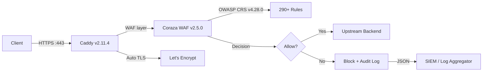

<div align="center">


# Caddy WAF | Developmi

_Protect your web applications with enterprise-grade WAF in under 5 minutes - eliminate false-positive risk during deployment and slash SOC2 audit prep time._

[](https://caddyserver.com)
[](https://hub.docker.com)
[](https://github.com/developmi/caddy-waf/actions)
[](https://github.com/developmi/caddy-waf/actions)
[](https://github.com/developmi/caddy-waf/pkgs/container/caddy-waf)
[](LICENSE)
[](https://www.bestpractices.dev/en/criteria)


> Curated by [Miguel Lozano](https://developmi.com) • [GitHub](https://github.com/developmi) • [Container Registry](https://github.com/developmi/caddy-waf/pkgs/container/caddy-waf)

</div>

---

## Table of contents

- [Overview](#-overview)
- [Quick Start](#-quick-start)
- [Architecture](#-architecture)
- [Configuration Guide](#-configuration-guide)
- [Docker Deployment](#-docker-deployment)
- [Testing & Validation](#-testing--validation)
- [Monitoring & Observability](#-monitoring--observability)
- [Operations Documentation](#-operations-documentation)
- [Security](#-security)
- [Changelog](#-changelog)
- [Contributing](#-contributing)
- [License](#-license)
- [Contact & Support](#-contact--support)

---

## 🎯 Overview

**Problem:** Deploying a web application firewall typically requires weeks of tuning, dedicated appliances, and specialized security expertise. Most WAF solutions block legitimate traffic on day one, disrupting your users and forcing you to disable protections you just deployed.

**This project solves that.** It packages Caddy - the web server that automatically provisions TLS - with Coraza WAF and the OWASP Core Rule Set into a single hardened container. The WAF defaults to **DetectionOnly mode**, giving you a safe observation window before enforcement. You get 290+ protection rules covering SQL injection, XSS, command injection, and the entire OWASP Top 10 - without blocking a single legitimate request until you're ready.

Starting from v3.0.0, the image ships with updated Caddy 2.11.4, official upstream rate limiting and DNS plugins, and native security header support - giving the project full control over maintenance cadence, security patches, and feature development.

### ✨ Features

#### 🔒 Security First
- **Non-root execution**: Runs as `caddy` user (UID 1337) - no root privileges
- **Supply chain security**: Pinned versions, SHA256 verification of OWASP CRS rules, Cosign-signed images, SBOM attestations
- **Multi-stage builds**: Minimal attack surface, optimized layers
- **Health monitoring**: Process verification healthcheck at both image and compose level
- **Structured logging**: JSON logs for SIEM integration

#### 🛡️ WAF Capabilities
- **Coraza WAF v2.5.0**: Modern, high-performance web application firewall engine
- **OWASP CRS v4.28.0**: Latest Core Rule Set with 290+ protection rules
- **DetectionOnly by default**: Prevents false positives in new deployments
- **Audit logging**: JSON audit logs to stdout for easy monitoring
- **Rate limiting**: Built-in rate limiting via `mholt/caddy-ratelimit`
- **Security headers**: Automated security header injection via Caddy's native `header` directive

#### 🚀 Production Ready
- **Optimized Alpine base**: Small footprint (~45MB compressed)
- **TLS by default**: Automatic Let's Encrypt integration
- **Multi-architecture**: Supports linux/amd64 and linux/arm64
- **Cloud-native**: Perfect for Kubernetes, Docker Swarm, and standalone Docker
- **Bare-metal ready**: Systemd service file included for non-containerized deployments

---

## ⚡ Quick Start

### Prerequisites

- Docker 24.x+ and Docker Compose v2.x+

### 1. Pull the Image
```bash
docker pull ghcr.io/developmi/caddy-waf:v3.3.2
```

### 2. Create Environment File
```bash
cp .env.example .env
# Edit .env with your domain/backend/image values
```

### 3. Create Runtime Caddyfile From Template
```bash
cp Caddyfile.example Caddyfile
# Edit Caddyfile for your domain and upstreams
```

### 4. Build Your Custom Image (Recommended for your own distribution)
```bash
docker build -t your-registry/your-caddy-waf:custom \
  --build-arg CORAZA_CADDY_REF=v2.5.0 \
  --build-arg CADDY_RATELIMIT_REF=5625512 \
  --build-arg CADDY_DNS_CLOUDFLARE_REF=v0.2.4 \
  .
```

Then set `CADDY_WAF_IMAGE=your-registry/your-caddy-waf:custom` in `.env`.

### 5. Basic Caddyfile Configuration
```caddyfile
{
    order coraza_waf first
}

yourdomain.com {
    respond "Caddy with Coraza WAF is running" 200
}
```

### 6. Start the Container
```bash
docker compose up -d
```

---

## 🏗️ Architecture

```
caddy-waf/
├── assets/                   # Brand assets (logo)
├── deploy/
│   └── systemd/              # Systemd service unit for bare-metal
├── docs/                     # Operations docs (deployment, IR, compliance)
├── .github/workflows/        # CI/CD (build, scan, sign, push)
├── metrics/                  # Backend-agnostic Prometheus scrape config
├── grafana/                  # Provisioned datasources + dashboards
├── Dockerfile                # Multi-stage build with pinned plugins
├── docker-compose.yml        # Production-grade compose with security hardening
├── Caddyfile                 # Runtime configuration — untracked, generated from Caddyfile.example (WAF + TLS + reverse proxy)
├── Caddyfile.example         # Templated configuration with 5 deployment examples
├── .env.example              # Environment variable template (3 groups)
├── TUNING.md                 # WAF tuning guide per application type
├── ROADMAP.md                # Planned enhancements and compliance roadmap
├── CHANGELOG.md              # Version history (Keep a Changelog)
├── CONTRIBUTING.md           # Contribution guidelines
├── SECURITY.md               # Vulnerability disclosure policy
└── LICENSE                   # MIT License
```

### Data flow



---

## 📖 Configuration Guide

### WAF Modes
The WAF operates in three modes (configured in Caddyfile):

1. **DetectionOnly** (Default): Logs attacks without blocking - perfect for initial deployment
2. **On**: Active protection - blocks malicious requests
3. **Off**: Disables WAF completely

> **Recommended rollout:** Keep `SecRuleEngine DetectionOnly` for a 7–14 day observation window. Review audit logs, tune CRS exclusions, then switch to `SecRuleEngine On` only after establishing a stable false-positive baseline.

### Example Caddyfile with WAF
```caddyfile
{
    email admin@example.com
    order coraza_waf first

    # JSON logging for observability
    log {
        output stdout
        format json
    }
}

(waf) {
    coraza_waf {
        directives `
            Include /etc/caddy/coraza.conf
            Include /etc/caddy/owasp-crs/crs-setup.conf
            Include /etc/caddy/owasp-crs/rules/*.conf

            # Start with DetectionOnly, change to On after tuning
            SecRuleEngine DetectionOnly

            # Audit logging
            SecAuditEngine RelevantOnly
            SecAuditLog /dev/stdout
            SecAuditLogFormat JSON
        `
    }
}

# Your site configuration
example.com {
    import waf
    reverse_proxy backend:8080
}
```

### Advanced Configuration
For detailed WAF tuning, rule exceptions, and performance optimization, see the complete [TUNING GUIDE](TUNING.md).

Project roadmap and planned security integrations are tracked in [ROADMAP.md](ROADMAP.md).

### Using Custom OWASP CRS Rules
Mount your custom rules directory:
```yaml
volumes:
  - ./custom-crs:/etc/caddy/owasp-crs
```

### Environment Variables
| Variable | Default | Description |
|----------|---------|-------------|
| `CADDY_WAF_IMAGE` | `ghcr.io/developmi/caddy-waf:v3.3.2` | Caddy WAF image reference |
| `EXAMPLE_APP_IMAGE` | `containous/whoami:latest` | Demo backend image |
| `SITE_ADDRESS` | `localhost` | Site address/server name used by Caddy |
| `BACKEND_UPSTREAM` | `example-app:80` | Reverse proxy backend upstream |
| `ACME_EMAIL` | (empty) | Email for Let's Encrypt certificates |

### Plugins Included
- `github.com/corazawaf/coraza-caddy/v2@v2.5.0` - Coraza WAF integration
- `github.com/mholt/caddy-ratelimit@v0.1.0` - Rate limiting (DDoS protection)

> **Note:** `caddy-ratelimit` development is active but releases are not tagged beyond `v0.1.0`. This image pins the module by commit SHA (`5625512`) to include post-tag fixes. See [Dockerfile](./Dockerfile) for the pinned reference.

- `github.com/caddy-dns/cloudflare@v0.2.4` - Cloudflare DNS for ACME challenges

> **Security headers** are handled via Caddy's native `header` directive - no external plugin needed.

---

## 🐳 Docker Deployment

### Default compose stack
```bash
# Start with example backend
cp .env.example .env
cp Caddyfile.example Caddyfile
docker compose up -d
```

### Build from source
```bash
docker build \
  --build-arg CORAZA_CADDY_REF=v2.5.0 \
  --build-arg CADDY_RATELIMIT_REF=5625512 \
  --build-arg CADDY_DNS_CLOUDFLARE_REF=v0.2.4 \
  -t caddy-waf:custom .
```

### Systemd deployment (bare-metal)
The unit runs on the **host network namespace**, so it uses the zero-trust
config `deploy/systemd/Caddyfile.systemd` — the admin API is bound to loopback
only (`admin localhost:2019`). Never use `0.0.0.0:2019` on a host network: the
admin API accepts config POSTs.

```bash
sudo cp deploy/systemd/caddy-waf.service /etc/systemd/system/
sudo useradd -r -s /usr/sbin/nologin caddy-waf
sudo install -o caddy-waf -g caddy-waf -m 0640 deploy/systemd/Caddyfile.systemd /etc/caddy/Caddyfile
sudo -u caddy-waf caddy validate --config /etc/caddy/Caddyfile
sudo systemctl daemon-reload
sudo systemctl enable --now caddy-waf
```

### Supply chain verification

Verify the image signature before pulling in production:

```bash
cosign verify \
  --certificate-identity "https://github.com/developmi/caddy-waf/.github/workflows/docker-build-scan-sign.yml@refs/heads/main" \
  --certificate-oidc-issuer "https://token.actions.githubusercontent.com" \
  ghcr.io/developmi/caddy-waf@sha256:<digest>
```

> **Tip:** Use immutable image digests (`@sha256:...`) instead of version tags in production for deterministic deployments.

---

## 🧪 Testing & Validation

### Verify Installation
```bash
# Check container health
docker ps --filter "name=caddy-waf"

# View logs
docker logs caddy-waf

# Test WAF is working
curl -I https://yourdomain.com
```

### Security Scanning
```bash
# Scan image with Trivy
docker run --rm aquasec/trivy image ghcr.io/developmi/caddy-waf:v3.3.2

# Scan with Docker Scout
docker scout quickview ghcr.io/developmi/caddy-waf:v3.3.2
```

---

## 📈 Monitoring & Observability

### Log Structure
```json
{
  "level": "info",
  "ts": 1678901234.567,
  "logger": "http.log.access",
  "msg": "handled request",
  "request": {
    "method": "GET",
    "uri": "/test",
    "proto": "HTTP/2",
    "remote_ip": "192.168.1.100"
  },
  "waf_action": "detected",
  "waf_rule_id": "941100"
}
```

### WAF Metrics to Monitor
The Caddy admin endpoint (`:2019/metrics`) exposes real Prometheus metrics:

- `caddy_http_requests_total` - Total requests (labels: server, handler, method)
- `caddy_http_request_duration_seconds` - Request latency histogram (labels include `code`)
- `caddy_http_requests_in_flight` - Concurrent requests gauge
- `caddy_reverse_proxy_upstreams_healthy` - Backend upstream health (0/1)
- `caddy_config_last_reload_successful` - Config reload status

> **Note:** coraza-caddy v2.5.0 does not export `coraza_waf_*` metrics (upstream
> limitation). WAF rule IDs and decisions are available in the JSON audit log on
> stdout, not on `/metrics`.

---

## 📊 Observability (metrics + dashboards)

Dual-backend observability: the same `metrics/prometheus.yml` scrape config
works with **both** VictoriaMetrics and Prometheus (identical Prometheus
exposition format), so Caddy's `/metrics` output needs no changes. Pick one
profile:

```bash
# VictoriaMetrics + Grafana (Grafana on http://localhost:3000)
docker compose --profile observability-vm up -d

# Prometheus + Grafana (Grafana on http://localhost:3001)
docker compose --profile observability-prom up -d
```

Profile services are **not** started by plain `docker compose up` — default
behavior is unchanged. Grafana is bound to loopback only (127.0.0.1), with
anonymous read access so the dashboard opens without login
(admin UI: `admin` / `admin`, override with `GRAFANA_ADMIN_USER` /
`GRAFANA_ADMIN_PASSWORD`).

### How it works

- `metrics/prometheus.yml` — single canonical scrape config, mounted read-only:
  VictoriaMetrics consumes it via `-promscrape.config`, Prometheus via
  `--config.file`. Targets the internal `caddy-waf:2019`.
- Caddyfile.example exposes the admin endpoint (`/metrics`) on `0.0.0.0:2019` and
  enables `caddy_http_*` metric collection.
- Each profile provisions its own Grafana datasource (VictoriaMetrics or
  Prometheus) pointing at the backend, and loads the same dashboard
  (`grafana/dashboards/caddy-waf.json`): request rate, status codes, p95
  latency, in-flight requests, backend health, throughput, request errors, plus
  a WAF mode note.

### Security

Port `2019` (Caddy admin API) is **never published to the host** — the admin
API can accept config POSTs, so it stays strictly inside the internal Docker
network. Scraping happens over the `caddy-network` bridge only. Backends
(VictoriaMetrics:8428, Prometheus:9090) are also internal-only.

### Tear down

```bash
docker compose --profile observability-vm down -v
docker compose --profile observability-prom down -v
```

See [TUNING.md](TUNING.md#6-monitoring-and-alerts) for metric details.

---

## 🧭 Operations Documentation

Operational runbooks live in [`docs/`](docs/):

| Document | Purpose |
|----------|---------|
| [Deployment checklist](docs/deployment-checklist.md) | Step-by-step deploy, verify, and rollback for Docker Compose and systemd (bare-metal) |
| [Incident response](docs/incident-response.md) | Runbook for WAF false positives and generic incidents, with severity table |
| [SOC 2 mappings](docs/soc2-mappings.md) | Trust Services Criteria mapped to implemented controls, with file:line evidence and honest gaps |
| [SLSA compliance](docs/slsa-compliance.md) | Supply-chain level assessment of the build pipeline (current: L2, partial L3) |

---

## 🔒 Security

This project follows a coordinated disclosure policy.
If you discover a vulnerability, **do not open a public issue**.
See [SECURITY.md](./SECURITY.md) for:
- Supported versions
- Reporting instructions (GitHub Advisory + email)
- Response timelines (48h acknowledgment, 30-day fix target)
- Supply chain verification (Cosign + Trivy)

### Supported versions

| Version | Supported |
|---------|-----------|
| 3.3.x   | ✅ Yes (current) |
| 2.0.x   | ❌ No     |
| 1.0.x   | ❌ No     |

---

## 📋 Security Advisory

Security advisories and resolved CVEs are documented in [SECURITY.md](./SECURITY.md#resolved-cves).

---


---

## 📋 Changelog

See [CHANGELOG.md](./CHANGELOG.md) for the full version history.
The project follows [Keep a Changelog](https://keepachangelog.com/) and [Semantic Versioning](https://semver.org/).

| Version | Date | Highlights |
|---------|------|------------|
| [3.3.1](./CHANGELOG.md#331--2026-08-11) | 2026-08-11 | HEALTHCHECK via admin /metrics (curl), resource limits (512m/1 CPU), JSON-file log rotation, version alignment |
| [3.3.2](./CHANGELOG.md#332--2026-08-14) | 2026-08-14 | WAF default active (DetectionOnly), dual-arch scanning, boot regression gate, systemd variant tracked |
| [3.3.0](./CHANGELOG.md#330--2026-08-11) | 2026-08-11 | Tool bumps (hadolint 2.15.1, go-ftw 2.5.0, Trivy v0.73.0), full apk upgrade, HEALTHCHECK JSON, version alignment |
| [3.0.0](./CHANGELOG.md#300--2026-07-01) | 2026-07-01 | Caddy 2.11.4 upgrade, Official upstream plugins, CVE fixes, security headers plugin |
| [2.0.0](./CHANGELOG.md#200--2026-03-14) | 2026-03-14 | Security hardening, systemd, OCI labels, CI updates |
| [1.0.0](./CHANGELOG.md#100--2026-02-09) | 2026-02-09 | Initial release with Coraza WAF + OWASP CRS |

---

## 🤝 Contributing

Contributions are welcome. Please read [CONTRIBUTING.md](./CONTRIBUTING.md) before opening a pull request.
This project follows [Conventional Commits](https://www.conventionalcommits.org/) and the Developmi engineering standard.

### Quick links
- **Report a bug or request a feature:** [GitHub Issues](https://github.com/developmi/caddy-waf/issues)
- **Advanced configuration:** [TUNING.md](TUNING.md)
- **Roadmap:** [ROADMAP.md](ROADMAP.md)

### Commercial Support
For enterprise support, custom configurations, or security consulting:
- **Website:** [developmi.com](https://developmi.com)
- **Email:** miguel@developmi.com
- **GitHub:** [developmi](https://github.com/developmi)

---

## 📄 License

Copyright © 2026 Miguel Lozano | Developmi. All rights reserved.
Licensed under the [MIT License](./LICENSE).

## 🙏 Acknowledgments

- [Caddy Server](https://caddyserver.com) - Amazing web server with automatic HTTPS
- [Coraza WAF](https://coraza.io) - Enterprise-grade WAF engine
- [OWASP Core Rule Set](https://coreruleset.org) - Industry-standard protection rules
- [Developmi](https://developmi.com) - DevOps & Security consulting

---

## 🤝 Contact & Support

**Maintained by:** Miguel Lozano | Developmi

- **Role:** Cloud & Infrastructure Engineer | FinOps & Bare Metal Specialist | AI Sovereignty Strategist under NIST/DORA Standards
- **Philosophy:** _Security is not a feature; it is the baseline._
- **Website:** [developmi.com](https://developmi.com)
- **GitHub:** [developmi](https://github.com/developmi)
- **LinkedIn:** [Miguel Lozano](https://www.linkedin.com/in/miguel-dev-ops)

---

© 2026 Miguel Lozano | Developmi. All rights reserved.
